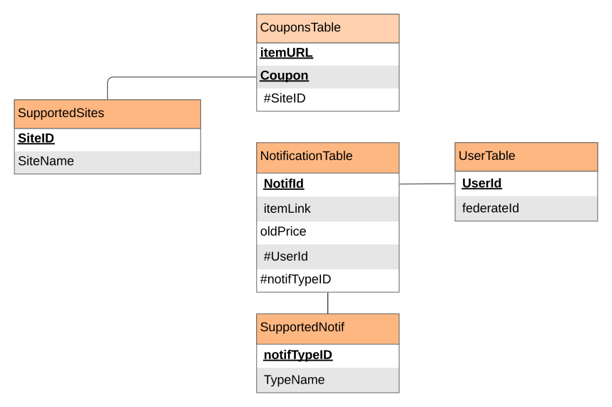

# DEVELOPMENT AND DESIGN OF SERVICES THAT HELP IMPROVE YOUR ONLINE SHOPPING EXPERIENCE USING SOA Architecture.

# Abstract

It’s hard to find a market that has been more shaken up by the popularity of the internet than commerce. From mom and pop shops in your local area to retail giants, online shopping has completely changed the game when it  comes to convincing shoppers to purchase goods from physical stores or even when it's presented as a digital content such as online courses. And with this change of events, the competition between the companies had skyrocket pushing them to use all kinds of strategies for their clients which have no way of defending themselves. Here we present two services which can be used by the client application: the first can check for the availability of coupons for an item, the second can be set to notify the client for when an item's price has gotten reduced bellow a threshold, and then we would be writing a browser extension that would invoke and use our web services.


[TOC]


# 1. General Introduction :

## 	1.1. Introducing the problem :

​			There are so many e-commerce business startups that fail (80% or more), and this should not come as a surprise since most business startups fail regardless of their type. However, e-commerce business failures happen because of reasons specific to the online world in addition to fundamental business oversights. The online business landscape has matured since the wild west days of the late 1990s and early 2000s. A great idea and a website with some traffic may have worked back then, but probably isn’t enough for success in today’s competitive online landscape, since the companies have to keep track of so many new challenging problems nowadays such as the quality of their user's experience on the website, the trust of the clients and the ability to compete with other successful online stores that are companies with specialized staff that do its many operations. These might include content writers, marketing people, SEO specialists, social media experts, and so forth. 

*So where does the customer come into in all of this ?*

When you check out popular e-commerce websites these days, you can easily see how well-researched and organized they are to present products and prices, to the point where they could entice a customer to buy a very expensive item that contains an enormous red number next to a percentage as a discount, having no clue how the original price of the item was increased to a ridiculously big number only to return to what it was originally a month ago or even greater. And with that, you start to realize how good the companies and retailers has gotten at engaging in the marketing games or what can be described as a scam in certain situations.

*And here is the question of what a simple customer can do to make his online shopping experience better and more profitable for himself ?.*

## 	1.2. Defining the Solution :

​			As a solution to the online shopping's struggles which the customer is  facing and is going to keep encountering as long as the web exists, we  suggest creating web services, that gives all kinds of handful flexible tools to a client, Improving his shopping experience by aiding him at making better choices online, and giving client-programmers and developers flexible web services which can be used to creative more handy services/tools, making the Internet a better place. 

In this document we would be documenting the creation of two main services, one which is supposed to fetch possible working coupons for an item - *that is supplied by a giving URL* - and the second is a service that can be set to notify the users for changes in the prices of a given items. These services need to be flexible and scalable to facilitate adding additional support and functionality to additional commercial websites, and this is the very part where the SOA architecture would be useful.

Since this project aligns with some of the functionality which the **Honey (company)** offers, We would formulate the problem we are going to solve as follows, we would be going through the rest of the document as if we are trying to start a similar company which we are going to call **"LucKey"** which is supposed to operate a browser extension that aggregates and automatically applies online coupons, plus offer a notification functionality as a service which can be set to monitor the prices of displayed items on the websites we support and notify the user of changes on their prices and/or the availability of price reductions throughout later aggregated coupons. 

In the next sections we are going to extract the business requirements, the actors/stakeholders and the main services that would be used by our own extension. 

### 1.2.1. Describing the functionalities :

​			Since **"LucKey"** is going to be a browser extension, it would be presented to clients as a small interface on the side that could be opened and closed when needed - *and that's when the user wants to check for the availability of online coupons, on configure a notification system* - .

The general usage of  **LucKey** should be presented as follows :

* Give the client the ability to login.
* When the client is logged in, he can use our offered services:
  * Get the best coupon applied on the opened item.
  * Set up a notification system on price changes of an item.

### 1.2.2. Identifying the actors :

​			From the different functionalities listed above we could infer the actors we Have in our almost digital company : 

* **Client (external actor):** The most obvious one since he's the one that would be interacting with our extension through a small opened window on the browser's page.
* **IT department (internal actor):**  Since the application that does the actual work would be hosted on the cloud. This department should take care of getting feedbacks, adding additional microservices, adding more functionality to old services and taking care of the security and the availability of our services, databases and virtual servers. 
* **Gmail (external actor):**  Since we would be using a Gmail email to notify the clients, Gmail can be considered as a stakeholder.
* **Nexmo (external actor):** Can be considered as an other stakeholder which offers an API that gives us the capability to notify client by sending SMS messages.
* **Google and Facebook (external actors):** Can also be considered as other stakeholders since we de be using some of their services to offer easy authentication to the client. 

### 1.2.3. Defining the business rules :

​			For each process there are constraints and conditions that must be met in order to be able to use one of our offered services, theses constraints are listed bellow : 

1. **Login rule :**  For a client to login for our services one must login or get registered, and to do so a Facebook account, or a google account is required.
2. **Checking for coupons rule : **For a client to use this service, one must meet all of these conditions : 
   1. Be connected to the extension.
   2. Have one of the website that we support open.
   3. The official item's page must be open when the extension is being used.
3. **Setting up a notification alarm rule :**  **For a client to use this service, one must meet all of these conditions : 
   1. Be connected to the extension.
   2. Have one of the website that we support open.
   3. Enter a valid Phone Number if the client requests a SMS notification.
   4. Enter a valid Email address if the client requests an Email notification.

## 1.3. Conclusion :

​			In this chapter we defined the problem, how the **"LucKey"** extension we are making is going to be of service, and finally some rules and statements that gives a general description of the "company" from which we would be modeling and extracting the actual services and microservices in the following chapters.

# 2. State of the art :

​			This chapter present the SOA Manifesto and then breaks it down to elaborate on the meanings and implications of its individual statements. In addition to fostering a deeper understanding of service-orientation, this exploration of values and priorities can help determine their compatibility with an organization’s own values, priorities, and goals. Then it follows it with an application of the learned SOA concepts presented as an analysis and design of our project.

## 	2.1. The SOA Manifesto :

​			The following is the verbatim SOA Manifesto, as originally published at [www.soa-manifesto.org](www.soa-manifesto.org). 

> Service orientation is a paradigm that frames what you do. Service-oriented architecture (SOA) is a type of architecture that results from applying service-orientation. We have been applying service orientation to help organizations consistently deliver sustainable business value, with increased agility and cost effectiveness, in line with changing business needs.
> Through our work we have come to prioritize: 
>
> * Business value over technical strategy 
> * Strategic goals over project-specific benefits 
> * Intrinsic interoperability over custom integration 
> * Shared services over specific-purpose implementations 
> * Flexibility over optimization
> * Evolutionary refinement over pursuit of initial perfection
>
> That is, while we value the items on the right, we value the items on the left more. 
> Guiding Principles 
> We follow these principles: 
>
> *  Respect the social and power structure of the organization.
> * Recognize that SOA ultimately demands change on many levels. 
> * The scope of SOA adoption can vary. Keep efforts manageable and within meaningful boundaries. 
> * Products and standards alone will neither give you SOA nor apply the service orientation paradigm for you. 
> *  SOA can be realized through a variety of technologies and standards. 
> *  Establish a uniform set of enterprise standards and policies based on industry, de facto, and community standards.
> * Pursue uniformity on the outside while allowing diversity on the inside. 
> *  Identify services through collaboration with business and technology stakeholders. 
> * Maximize service usage by considering the current and future scope of utilization.
> * Verify that services satisfy business requirements and goals. 
> * Evolve services and their organization in response to real use. 
> * Separate the different aspects of a system that change at different rates.
> * Reduce implicit dependencies and publish all external dependencies to increase robustness and reduce the impact of change.
> * At every level of abstraction, organize each service around a cohesive and manageable unit of functionality. 

## 2.2. The SOA Manifesto Explored :

​			Subsequent to the announcement of the SOA Manifesto, an annotated version was authored specifically for the Next Generation SOA: A Concise Introduction to Service Technology & Service-Orientation book. It was published in advance at [www.soa-manifesto.com](https://patterns.arcitura.com/soa-patterns/basics/soamanifesto/annotated) to facilitate discussion of the manifesto’s statements within the industry. 

Provided in this section are parts of the original Annotated SOA Manifesto content with some minor revisions :

### 2.2.1. Preamble : 

>  **Service orientation** is a paradigm that frames what you do. **Service-oriented architecture (SOA)** is a type of architecture that results from applying service orientation. 

​			From the beginning it was understood that this was to be a manifesto about two distinct yet closely related topics: the service-oriented architectural model and service orientation, the paradigm through which the architecture is defined. 			

> We have been applying service orientation… 

​			The service orientation paradigm is best viewed as a method or an approach for realizing a specific target state that is further defined by a set of strategic goals and benefits. When we apply service orientation, we shape software programs and technology architecture in support of realizing this target state. This is what qualifies technology architecture as being service-oriented.

> …to help organizations consistently deliver sustainable business value, with increased agility and cost effectiveness… 

​			Agility at a business level is comparable to an organization’s responsiveness. The more easily and effectively an organization can respond to business change, the more efficient and successful it will be at adapting to the impacts of the change (and further leveraging whatever benefits the change may bring about).

Service-orientation positions services as IT assets that are expected to provide repeated value over time that far exceeds the initial investment required for their delivery. Cost-effectiveness relates primarily to this expected return on investment. In many ways, an increase in cost effectiveness goes hand-in-hand with an increase in agility; if there is more opportunity to reuse existing services, then there is generally less expense required to build new solutions. 

*“Sustainable”* business value refers to the long-term goals of service-orientation to establish software programs as services that possess the inherent flexibility to be continually composed into new solution configurations and evolved to accommodate ever-changing business requirements. 

> …in line with changing business needs.

​			These last six words of the preamble are key to understanding the underlying philosophy of service-oriented computing. The need to accommodate business change on an ongoing basis is foundational to service-orientation and considered a fundamental overarching strategic goal. 

### 2.2.2. Priorities :

> Through our work we have come to prioritize: 

​			The upcoming statements establish a core set of values, each of which is expressed as a prioritization over something that is also considered of value. 

>  Business value over technical strategy

​			The need to accommodate business change is an overarching strategic goal. Therefore, the foundational quality of service-oriented architecture and of any software programs, solutions, and ecosystems that result from the adoption of service-orientation is that they are business-driven. It is not about technology determining the direction of the business; it is about the business vision dictating the utilization of technology. 

> Strategic goals over project-specific benefits 

​			Historically, many IT projects focused solely on building applications designed specifically to automate business process requirements that were current at that time. This fulfilled immediate (tactical) needs, but as more of these single-purpose applications were delivered, it resulted in an IT enterprise filled with islands of logic and data referred to as application “silos”. As new business requirements would emerge, either new silos were created or integration channels between silos were established. As yet more business change arose, integration channels had to be augmented, even more silos had to be created, and soon the IT enterprise landscape became convoluted and increasingly burdensome, expensive, and slow to evolve. 

In many ways, service-orientation emerged in response to these problems. It is a paradigm that provides an alternative to project-specific, silo-based, and integrated application development by adamantly prioritizing the attainment of long-term, strategic business goals. The target state advocated by service-orientation does not have traditional application silos. And even when legacy resources and application silos exist in environments where service orientation is adopted, the target state is one where they are harmonized to whatever extent feasible.

> Intrinsic interoperability over custom integration 

​			For software programs to share data they need to be interoperable. If software programs are not designed to be compatible, they will likely not be interoperable. To enable interoperability between incompatible software programs requires that they be integrated. Integration is therefore the effort required to achieve interoperability between disparate software programs.

One of the goals of service-orientation is to minimize the need for customized integration by shaping software programs (within a given domain) so that they are natively compatible. This is a quality referred to as intrinsic interoperability. The design principles encompassed by the service-orientation paradigm are geared toward establishing intrinsic interoperability on several levels. 

> Shared services over specific-purpose implementations 

​			When applied to a meaningful extent, service-orientation principles shape a software program into a unit of service oriented logic that can be legitimately referred to as a service. 

A shared service establishes itself as an IT asset that can provide repeated business value while decreasing the expense and effort to deliver new automation solutions. While there is value in traditional, single-purpose applications that solve tactical business requirements, the use of shared services provides greater value in realizing the strategic goals of service-oriented computing (which again includes an increase in cost-effectiveness and agility).

> Flexibility over optimization

​			This is perhaps the broadest of the value prioritization statements and is best viewed as a guiding philosophy for how to better prioritize various considerations when delivering and evolving individual services and inventories of services. 

Optimization primarily refers to the fulfillment of tactical gains by tuning a given application design or expediting its delivery to meet immediate needs. There is nothing undesirable about this, except that it can lead to the aforementioned silo-based environments when not properly prioritized in relation to fostering flexibility.

For example, the characteristic of flexibility goes beyond the ability for services to effectively (and intrinsically) share data. To be truly responsive to ever-changing business requirements, services must also be flexible in how they can be combined and aggregated into composite solutions. Unlike traditional distributed applications that often were relatively static despite the fact that they were componentized, service compositions need be designed with a level of inherent flexibility that allows for constant augmentation. This means that when an existing business process changes or when a new business process is introduced, we need to be able to add, remove, and extend services within the composition architecture with minimal (integration) effort. This is why Service Composability is one of the key service-orientation design principles.

> Evolutionary refinement over pursuit of initial perfection

​			Service-orientation advocates the attainment of agility on an organizational or business level with the intention of empowering the organization, as a whole, to be responsive to change. This form of organizational agility can also be referred to as “strategic agility” because the emphasis is on longevity in that, with every software program we deliver, we want to work toward a target state that fosters agility with long-term strategic value. 

For an IT enterprise to enable organizational agility, it must evolve in tandem with the business. We generally cannot predict how a business will need to evolve over time and therefore we cannot initially build the perfect services. At the same time, there is usually a wealth of knowledge already present within an organization’s existing business intelligence that can be harvested during the analysis and modeling stages of SOA projects.

This information, together with service-orientation principles and proven methodologies, can help us identify and define a set of services that capture how the business exists and operates today while being sufficiently flexible to adapt to how the business changes over time. 

> That is, while we value the items on the right, we value the items on the left more. 

​			By studying how these values are prioritized, we gain insight into what distinguishes service-orientation from other design approaches and paradigms. In addition to establishing fundamental criteria that we can use to determine how compatible service-orientation is for a given organization, it can further help determine the extent to which service-orientation can or should be adopted.

An appreciation of the core values can also help us understand how challenging it may be to successfully carry out SOA projects within certain environments. For example, several of these prioritizations may clash head-on with established beliefs and preferences. In such a case, the benefits of service-orientation need to be weighed against the effort and impact their adoption may have (not just on technology, but also on the organization and IT culture). 

*The upcoming guiding principles were provided to help address many of these types of challenges.* 

### 2.2.3. Guiding Principles :

​			So far, the manifesto has established an overall vision as well as a set of core values associated with the vision. The remainder of the declaration is comprised of a set of principles that are provided as guidance for adhering to the values and realizing the vision. 

> Respect the social and power structure of the organization

​			The adoption of service-orientation is about transforming the way we automate business. However, regardless of what plans we may have for making this transformation effort happen, we must always begin with an understanding and an appreciation of the organization, its structure, its goals, and its culture.			

The adoption of service-orientation is very much a human experience. It requires support from those in authority and asks that the IT culture adopt a strategic, community-centric mindset. We must fully acknowledge and plan for this level of organizational change in order to receive the necessary long-term commitments required to achieve the target state of service-orientation.

> Recognize that SOA ultimately demands change on many levels. 

​			There’s a saying that goes: “Success is being prepared for opportunity.” Perhaps the number one lesson learned from SOA projects that have been carried out in the past is that we must fully comprehend and then plan and prepare for the volume and range of change that is brought about as a result of adopting service-orientation. 

For examples, service-orientation changes how we build automation solutions by positioning software programs as IT assets with long-term, repeatable business value. Depending on the extent to which cloud-based infrastructure may be leveraged, a significant up-front investment may be required to create an environment comprised of such assets. Furthermore, an ongoing commitment is required to maintain and leverage their value. So, right out of the gate, changes are required to how we fund, measure, and maintain systems within the IT enterprise.

> The scope of SOA adoption can vary. Keep efforts manageable and within meaningful boundaries.

​			A common myth has been that in order to realize the strategic goals of service-oriented computing, service-orientation must be adopted on an enterprise-wide basis. This means establishing and enforcing design and industry standards across the IT enterprise so as to create an enterprise-wide inventory of intrinsically interoperable services. While there is nothing wrong with this ideal, it is not a realistic goal for many organizations, especially those with larger IT enterprises. 

The most appropriate scope for any given SOA adoption effort needs to be determined as a result of planning and analysis in conjunction with pragmatic considerations, such as the aforementioned impacts on organizational structures, areas of authority, and cultural changes that are brought about. Taking the Balanced Scope pillar into account during the planning stages assists in determining a suitable, initial adoption scope based on an organization’s maturity and readiness.

> Products and standards alone will neither give you SOA nor apply the service-orientation paradigm for you. 

​			This guiding principle addresses two separate but very much related myths. The first is that you can buy your way into SOA with modern technology products, and the second is the assumption that the adoption of industry standards (such as XML, WSDL, SCA, etc.) will naturally result in service-oriented technology architecture. 

The vendor and industry standards communities have been credited with building modern service technology innovation upon non-proprietary frameworks and platforms. Everything from service virtualization to cloud computing and grid computing has helped advance the potential for building sophisticated and complex service-oriented solutions. However, none of these technologies are exclusive to SOA. You can just as easily build silo-based systems in the cloud as you can on your own private servers. 

There is no such thing as “SOA in a box” because in order to achieve service-oriented technology architecture, service-orientation needs to be successfully applied; this, in turn, requires everything that we design and build to be driven by the unique direction, vision, and requirements of the business. 

> SOA can be realized through a variety of technologies and standards. 

​			Service-orientation is a technology-neutral and vendor-neutral paradigm. Service-oriented architecture is a technology-neutral and vendor-neutral architectural model. Service-oriented computing can be viewed as a specialized form of distributed computing. Service-oriented solutions can therefore be built using just about any technologies and industry standards suitable for distributed computing. 

> Establish a uniform set of enterprise standards and policies based on industry, de facto, and community standards

​			Industry standards represent non-proprietary technology specifications that help establish, among other things, consistent baseline characteristics (such as transport, interface, message format, etc.) of technology architecture. However, the use of industry standards alone does not guarantee that services will be intrinsically interoperable. 

For two software programs to be fully compatible, additional conventions (such as data models and policies) need to be adhered to. This is why IT enterprises must establish and enforce design standards. Failure to properly standardize and regulate the standardization of services within a given domain will begin to tear at the fabric of interoperability upon which the realization of many strategic benefits relies. 

This guiding principle advocates the use of enterprise design standards and design principles, such as Standardized Service Contract and Service Loose Coupling. It also reminds us that, whenever possible and feasible, custom design standards should be based upon and incorporate standards and service-orientation design principles already in use by the industry and the community in general.

> Pursue uniformity on the outside while allowing diversity on the inside. 

​			Federation can be defined as the unification of a set of disparate entities. While allowing each entity to be independently governed on the inside, all agree to adhere to a common, unified front.

A fundamental part of service-oriented architecture is the introduction of a federated endpoint layer that abstracts service implementation details while publishing a set of endpoints that represent individual services within a given domain in a unified manner. Accomplishing this generally involves achieving unity based on a combination of industry and design standards. The consistency of this unity across services is key to realizing intrinsic interoperability, as it represents the primary purpose and responsibility of the Standardized Service Contract design principle. 

> Identify services through collaboration with business and technology stakeholders.

​			In order for technology solutions to be business-driven, the technology must be in sync with the business. Therefore, another goal of service-oriented computing is to align technology and business via the application of service-orientation. The stage at which this alignment is initially accomplished is during the analysis and modeling processes that usually precede actual service development and delivery. 

The critical ingredient to carrying out service-oriented analysis is to have both business and technology experts working hand-in-hand to identify and define candidate services. For example, **business experts can help accurately define functional contexts** pertaining to business-centric services, while technology experts can provide pragmatic input to ensure that the granularity and definition of conceptual services remains realistic in relation to their eventual implementation environments. 

> Maximize service usage by considering the current and future scope of utilization. 

​			The extent of a given SOA project may be enterprise-wide or may be limited to a domain of the enterprise. Whatever the scope, a pre-defined boundary is established to encompass an inventory of services that need to be conceptually modeled before they can be developed. By modeling multiple services in relation to each other, we essentially establish a blueprint of the services we will eventually be building. This exercise is critical when attempting to identify and define services that can be shared by different solutions.

There are various methodologies and approaches that can be used to carry out service-oriented analysis stages. However, a common thread among all of them is that the functional boundaries of services be normalized to avoid redundancy. Even then, normalized services do not necessarily make for highly reusable services. Other factors come into play, such as service granularity, autonomy, state management, scalability, composability, and the extent to which service logic is sufficiently generic so that it can be effectively reused. These types of considerations as guided by business and technology expertise provide the opportunity to define services that capture current utilization requirements while possessing the flexibility to adapt to future change. 

> Verify that services satisfy business requirements and goals.

​			As with anything, services can be misused. When growing and managing a portfolio of services, their usage and effectiveness at fulfilling business requirements need to be verified and measured.

This is especially true with shared services that shoulder multiple dependencies. Not only do shared services require adequate infrastructure to guarantee scalability and reliability for all of the solutions that reuse them, they also need to be designed and extended with great care to ensure their functional contexts are never skewed. 

> Evolve services and their organization in response to real use. 

​			This guiding principle ties directly back to the *“Evolutionary refinement over pursuit of initial perfection”* value statement, as well as the overall goal of maintaining an alignment of business and technology. 

We can never expect to rely on guesswork when it comes to determining service granularity, the range of functions that services need to perform, or how services will need to be organized into compositions. Based on whatever extent of analysis we are able to initially perform, a given service will be assigned a defined functional context and will contain one or more functional capabilities that likely involve it in one or more service compositions. 

As real-world business requirements and circumstances change, the service may need to be augmented, extended, refactored, or perhaps even replaced. Service-orientation design principles build native flexibility into service architectures so that, as software programs, services are resilient and adaptive to change and to being changed in response to real-world usage. 

> Separate the different aspects of a system that change at different rates. 

​			What makes monolithic and silo-based systems inflexible is that change can have a significant impact on their existing usage. This is why it is often easier to create new silo-based applications rather than augment or extend existing ones. 

The rationale behind the separation of concerns theory is that a larger problem can be more effectively solved when decomposed into a set of smaller problems or concerns. When applying service-orientation to the separation of concerns, we build corresponding units of solution logic that solve individual concerns, thereby allowing us to aggregate the units to solve the larger problem in addition to giving us the opportunity to aggregate them into different configurations in order to solve other problems.

Besides fostering service reusability, this approach introduces numerous layers of abstraction that help shield service-comprised systems from the impacts of change. 

> Reduce implicit dependencies and publish all external dependencies to increase robustness and reduce the impact of change. 

This guiding principle embodies the purpose of the Service Loose Coupling design principle. How a service architecture is internally structured and how services relate to programs that consume them (which can include other services) all comes down to dependencies that are formed on individually moving parts that are part of the service architecture. Layers of abstraction help ease evolutionary change by localizing the impacts of the change to controlled regions. 

> At every level of abstraction, organize each service around a cohesive and manageable unit of functionality. 

​			Each service requires a well-defined functional context that determines what logic does and does not belong within the service’s functional boundary. Determining the scope and granularity of these functional service boundaries is one of the most critical responsibilities during the service delivery lifecycle. 

## 2.3. Conclusion : 

​			Many of the guiding principles described in this manifesto help to make this determination in support of positioning each service as an IT asset that is capable of furthering an IT enterprise toward that target state whereby the strategic benefits of service-oriented computing are realized. Ultimately, though, it is the attainment of real-world business value that dictates, from conception to delivery to repeated usage, the evolutionary path of any unit of service-oriented functionality.

# 3. Analyzing and Modeling the services :

​			In this chapter we are going to organize the information we gathered in the preceding chapters, together with the **SOA reference model**'s layers, to decompose the business processes into deployable modeled web services. which can be used to orchestrate our main composite services. 

## 	3.1. Business process layer :

​			The Business Process Layer refers to the business processes that are performed for the production of products and services. This level is dominated by the “business process logic” for the analysis of processes into activities and tasks. And the way we would be using this layer to extract the necessary entity service candidates is as follows : 

1. First, we start with a *BPMN Collaboration Diagram* to describe the processes our application have.
2. Second, we take a list of the business processes and we break it down into a series of granular process steps.
3. We repeat the 2nd step while their are processes that can be decomposed.
4. Then we go to the next step : **The business service layer**


### 3.1.1. BPMN Collaboration Diagram : 

​			Bellow is the collaboration diagram of our **"luckey"** extension, and since this project is mostly an IT project, we tried to minimize detailing the processes and how they would be implemented to the minimum and only keep the important logic on the Business process layer, so as to not end up creating a silo-based  information system, one which is incapable of reciprocal operations with others information systems that are, or should be, related.


### 3.1.2  Decompose the Business Process (into Granular Actions) :		

​			From the preceding diagram we can state the following main processes : 

1. Sign in/Sign up process.
2. Coupon aggregator process.
3. Notification setter process.

And in the rest of this section we would be decomposing theses processes into the smallest process steps. Starting from the first process : 

1. Sign in/Sign up process : 

   1. Receive a request from **LucKey** extension.
   2. If the received request is a sign up request : 
      1. Store the new User's information.
   3. Generate a unique ID for the User.
   4. Send a response message containing the generate ID back to the client
   5. **End**

   

2. Coupon aggregator process :

   1. Receive a request from the **LucKey** extension.
   2. Condition on the passed URL : 
      1. if we don't support the passed item's domain name. Send an informative message to the User and **End**.
      2. else, start the coupon aggregator **- service -** made for that specific website : 
         1. if a working coupon exists for that specific item send it.
         2. else aggregate possibly working coupons and send them to the client side, to try them.
         3. **End.**

**P.S.:** At this stage we can start to realize the utility of the SOA architecture since it seems that the coupon service's functionality would be limited to a finite set of supported website. But since the coupon aggregator for a specific website could be presented as a web service, maintaining and adding more support to new websites can feel more flexible and agile.

3. Notification setter process :
   1. Receive a request from the **LucKey** extension.
   2. Condition on the passed URL :
      1. if we don't support the passed item's domain name. Send an informative message to the User and **End**.
      2. else, loop through the user notification's chosen options (SMS/Email...)
      3. Set the corresponding service to launch 
         1. Get the initial price's value.
         2. wait a time interval before checking again.
         3. if price changed, continue executing the corresponding service.
         4. else, go back to step 2. (ii.) and keep waiting.
      4. if price changed send the corresponding notification, and **End.** 

## 3.2. The business service layer :

 			In this layer, we would be identifying service candidates. And we are going to do so by assessing the individual units of solution logic that are required to solve a larger problem, we may realize that only a subset of the logic is suitable for encapsulation within services.

The result of the encapsulation process would be presented bellow : 

* [Sign in/Sign up process service] : 
  (**Takes as input** : type_of_the_request, and information needed to execute the task) 
  (**Returns as output** : an identifier for the logged in client)
  **Invoked Micro-services :**

  1. if type_of_the_request is of type register : invoke [Register service] 
     1. [Sign up service] : 
        (**Takes as input : ** information needed to execute the registration) 
        (**Returns as output : ** internal ID affected to the user)
  2. invoke [Sign in service] : 
     1. [Sign in service] : 
        (**Takes as input : ** internal ID affected to the user) 
        (**Returns as output : ** external ID to identify the user)

* [Coupon aggregator service] 
  (**Takes as input :** the URL of the item)
  (**Returns as output :** A list of the possibly working coupons, or empty if not supported)
  **Invoked Micro-services :**

  1. [Coupon aggregator for a specific website **X** service] 
     (**Takes as input :** the URL of the item)
     (**Returns as output :** A list of possibly working coupon)

* [Notification setter service] 
  (**Takes as input:** Item_URL , condition_type, chosen_notification_types, address_location)
  (**Returns as output :** status_flag_of_the_request)
  **Invoked services :**

  1. [Notification thread]
     (**Takes as input:** Item_URL , condition_type, chosen_notification_types)
     (**Returns as output :** status)
     **Invoked Micro-services :**

     1. [Send notification of type **X** service] :

        (**Takes as input** : url, address_location)
        (**Returns as output :** flag)

So in this layer we could list the main composed services as follows : 

1. Sign in/Sign up process service.
2. Coupon aggregator service.
3. Notification setter service.


# 4. Implementation

## 4.1 Database Analysis : 

​			First of all we start by analyzing the type of data we will need to create our Database, and since that's not our main objective from this document we'll go past the steps and present the end model :

 

From this model we create our database which would be used by our services. then we configure a user named "admin" and a password:"1234" and a database named "luckeydb" in which we would be creating our tables above.


## 4.2 Setting up the environment:

​			In the following section we would be downloading and setting up our environment directly onto our home directory, since in this example we are working on an AWS EC2 Ubuntu instance, our home directory would be : **/home/ubuntu**.


### 4.2.1. Setting up Java:

#### What is Java?

​			Java is a general-purpose programming  language that is class-based, object-oriented, and designed to have as  few implementation dependencies as possible. It is intended to let  application developers write once, run anywhere, meaning that compiled  Java code can run on all platforms that support Java without the need  for recompilation.

#### Download and configuration: 

Download and install a Java Development Kit (JDK) release (version 1.5 or later) from http://java.sun.com/j2se/. Install the JDK according to the instructions included with the release. Set an environment variable JAVA_HOME to the pathname of the directory into which you installed the JDK release.

```bash
$ export PATH=$PATH:/home/ubuntu/jdk1.8.0_241/bin
$ export JAVA_HOME=/home/ubuntu/jdk1.8.0_241
```


### 4.2.2. Setting up Axis2:

#### What is Axis2?

​			The Apache Axis2 project is a Java-based implementation of both the client and server sides of the Web services equation. Designed to take advantage of the lessons learned from Apache Axis 1.0, Apache Axis2 provides a complete object model and a modular architecture that makes it easy to add functionality and support for new Web services-related specifications and recommendations.

Axis2 enables you to easily perform the following tasks:

* Send SOAP messages

- Receive and process SOAP messages
- Create a Web service out of a plain Java class
- Create implementation classes for both the server and client using WSDL
- Easily retrieve the WSDL for a service
- Send and receive SOAP messages with attachments
- Create or utilize a REST-based Web service
- Create or utilize services that take advantage of [ WS-Security](http://www.oasis-open.org/committees/download.php/16790/wss-v1.1-spec-os-SOAPMessageSecurity.pdf) and [WS-Addressing](http://www.w3.org/2002/ws/addr/)

Many more features exist as well, but this user guide concentrates on showing you how to accomplish the first five tasks on this list.

#### Download and configuration:

​			Download and unpack the Axis2 Binary Distribution into a convenient location **- the $HOME directory in our case -** so that the distribution resides in its own directory. Set an environment variables AXIS2_HOME to the pathname of the extracted directory of Axis2 Eg:

```bash
$ export AXIS2_HOME=/home/ubuntu/axis2/axis2-1.7.9
```


### 4.2.3. Setting up Tomcat:

#### What s Tomcat?

​			**Apache Tomcat** (sometimes simply "Tomcat") is an [open-source]implementation of the Java Servlet, JavaServer Pages, Java Expression Language and WebSocket technologies. Tomcat provides a "pure Java" HTTP web server environment in which Java code can run.

#### Download and configuration:

​			Download the binary of the **Tomcat** server, available from https://tomcat.apache.org/. Detailed instructions for downloading and installing Tomcat are available [here](https://tomcat.apache.org/tomcat-7.0-doc/setup.html). and then set an environment variable `CATALINA_HOME` that contains the pathname to the directory in which Tomcat has been installed.

```bash
$ export CATALINA_HOME=/home/ubuntu/apache-tomcat-9.0.30
```

Then we set up our tomcat server to work with axis *Axis2*, by downloading the axis2 war distribution and moving the axis2.war file into  **$CATALINA_HOME/webapps/**:

```bash
$ cp axis2.war $CATALINA_HOME/webapps/
```


### 4.2.4. Setting up shortcuts:

And so as to set our configuration to run on every shell we run the commands :

```bash
$ echo 'export JAVA_HOME=/home/ubuntu/jdk1.8.0_241' >> ~/.bashrc
$ echo 'export PATH=$PATH:$JAVA_HOME/bin' >> ~/.bashrc
$ echo 'export AXIS2_HOME=/home/ubuntu/axis2/axis2-1.7.9' >> ~/.bashrc
$ echo 'export CATALINA_HOME=/home/ubuntu/apache-tomcat-9.0.30' >> ~/.bashrc
$ echo 'alias axis=$AXIS2_HOME/bin/axis2server.sh' >> ~/.bashrc
$ echo "alias lkey='mysql -u admin luckeydb -p1234'">> ~/.bashrc
$ echo "alias tomcat='/home/ubuntu/apache-tomcat-9.0.30/bin/catalina.sh run'">> ~/.bashrc
```

At the end of the setup our **~/.bashrc**, looks like this : 

```bash
ubuntu@ip-172-31-95-74:~$ tail ~/.bashrc

export PATH=$PATH:/home/ubuntu/jdk1.8.0_241/bin
export JAVA_HOME=/home/ubuntu/jdk1.8.0_241
export AXIS2_HOME=/home/ubuntu/axis2/axis2-1.7.9
export CATALINA_HOME=/home/ubuntu/apache-tomcat-9.0.30
alias axis=$AXIS2_HOME/bin/axis2server.sh
alias lkey='mysql -u admin luckeydb -p1234'
alias tomcat='/home/ubuntu/apache-tomcat-9.0.30/bin/catalina.sh run'
```

The $HOME directory looks like this : 

```
/home/ubuntu/
├── apache-tomcat-9.0.30
├── axis2
└── jdk1.8.0_241
```


## 4.3. Creating our services : 

​			To create our service we use the eclipse environment to create each service as a Dynamic Web Project, starting with the atomic services (*UdemyCoupon, EmailSender, SmsSender*) in our case, then create  our service compositions which implements the previously mentioned services :

### 4.3.1. Creating the service inventory : 

**Coupon Aggregator for Udemy :**


**Service which can send email :**


**Service which can send SMS :**


### 4.3.2. Deploying the service inventory :

After testing the code we deploy it as follows : 

For each service we create a folder as the one shown bellow containing the compiled class in its respective package, placing its dependencies into the lib folder, and then placing the *services.xml* in the META-INF folder :

The folder for our CouponUdemy service looks like this :

```
CouponUdemy/
├── com
│   └── luckey
│       └── aggregators
│           └── CouponUdemy.class
├── lib
│   └── mysql-connector-java-8.0.19.jar
└── META-INF
    └── services.xml
```

with the services.xml looking as follows, this files is the one mapping between the name of the service and the class to call for: 

```xml
<service name="CouponUdemy" >
        <Description>
                A Service Which takes a Udemy link and returns a json array containing coupons.
        </Description>
        <messageReceivers>
                <messageReceiver mep="http://www.w3.org/ns/wsdl/in-only" class="org.apache.axis2.rpc.receivers.RPCInOnlyMessageReceiver" />
                <messageReceiver  mep="http://www.w3.org/ns/wsdl/in-out"  class="org.apache.axis2.rpc.receivers.RPCMessageReceiver"/>
        </messageReceivers>
        <parameter name="ServiceClass" locked="false">com.luckey.aggregators.CouponUdemy</parameter>
</service>
```


The folder for our EmailSender service looks like this :

```
EmailSender/
├── luckey
│   └── notif
│       └── email
│           └── EmailSender.class
└── META-INF
    └── services.xml
```

with the services.xml looking as follows.

```xml
<service name="EmailSender" >
        <Description>
                A web service which can send an email to an address, input : emailText, emailTo.
        </Description>
        <messageReceivers>
                <messageReceiver mep="http://www.w3.org/ns/wsdl/in-only" class="org.apache.axis2.rpc.receivers.RPCInOnlyMessageReceiver" />
                <messageReceiver  mep="http://www.w3.org/ns/wsdl/in-out"  class="org.apache.axis2.rpc.receivers.RPCMessageReceiver"/>
        </messageReceivers>
        <parameter name="ServiceClass" locked="false">luckey.notif.email.EmailSender</parameter>
</service>
```


The folder for our SmsSender service looks like this :

```
SmsSender
├── lib
│   ├── annotations-13.0.jar
│   ├── client-5.2.1.jar
│   ├── commons-codec-1.11.jar
│   ├── commons-io-2.5.jar
│   ├── commons-lang3-3.5.jar
│   ├── commons-logging-1.2.jar
│   ├── httpclient-4.5.8.jar
│   ├── httpcore-4.4.11.jar
│   ├── jackson-annotations-2.9.0.jar
│   ├── jackson-core-2.9.9.jar
│   ├── jackson-databind-2.9.9.jar
│   ├── jackson-dataformat-hal-1.0.4.jar
│   ├── jackson-jaxrs-base-2.8.5.jar
│   ├── jackson-jaxrs-json-provider-2.8.5.jar
│   ├── jackson-module-jaxb-annotations-2.8.5.jar
│   ├── jaxb-api-2.3.0.jar
│   ├── jjwt-api-0.10.5.jar
│   ├── jjwt-impl-0.10.5.jar
│   ├── jjwt-jackson-0.10.5.jar
│   ├── jwt-1.0.1.jar
│   ├── kotlin-stdlib-1.3.31.jar
│   ├── kotlin-stdlib-common-1.3.31.jar
│   ├── kotlin-stdlib-jdk7-1.3.31.jar
│   ├── kotlin-stdlib-jdk8-1.3.31.jar
│   └── slf4j-api-1.7.21.jar
├── luckey
│   └── notif
│       └── smssender
│           └── SmsSender.class
└── META-INF
    └── services.xml
```

with the services.xml looking as follows.

```xml
<service name="SmsSender" >
        <Description>
                A web service which is capable to send a SMS. build on nexmo api, input : url, phoneN:string.
        </Description>
        <messageReceivers>
                <messageReceiver mep="http://www.w3.org/ns/wsdl/in-only" class="org.apache.axis2.rpc.receivers.RPCInOnlyMessageReceiver" />
                <messageReceiver  mep="http://www.w3.org/ns/wsdl/in-out"  class="org.apache.axis2.rpc.receivers.RPCMessageReceiver"/>
        </messageReceivers>
        <parameter name="ServiceClass" locked="false">luckey.notif.smssender.SmsSender</parameter>
</service>
```


And then upload theses folders to the AWS instance and specifically into :

```
/home/ubuntu/apache-tomcat-9.0.30/webapps/axis2/WEB-INF/services/
```


with this we would have finished deploying our services , to test them out we use postman and send **POST** request containing a SOAP request:

examples of the requests and the responses:

### 4.3.3. Testing the service inventory:

#### CouponUdemy :

URL to the webservice : 

```
35.153.41.154:8080/axis2/services/CouponUdemy/AggregateCoupons
```


The SOAP Request :

```xml
<soapenv:Envelope  
	  xmlns:q0="http://aggregators.luckey.com" 
	  xmlns:soapenv="http://schemas.xmlsoap.org/soap/envelope/"
	  xmlns:xsd="http://www.w3.org/2001/XMLSchema"
	  xmlns:xsi="http://www.w3.org/2001/XMLSchema-instance">
    <soapenv:Header></soapenv:Header>
    <soapenv:Body>
        <q0:SendMailRequest>
            <q0:url>https://www.udemy.com/course/design-conceptual-and-meaningful-logos</q0:url>
        </q0:SendMailRequest>
    </soapenv:Body>
</soapenv:Envelope>
```


Example of the SOAP response :

```xml
<?xml version='1.0' encoding='UTF-8'?>
<soapenv:Envelope xmlns:soapenv="http://schemas.xmlsoap.org/soap/envelope/">
    <soapenv:Header/>
    <soapenv:Body>
        <ns:AggregateCouponsResponse xmlns:ns="http://aggregators.luckey.com">
            <ns:return>[LOGO72HOURS]</ns:return>
        </ns:AggregateCouponsResponse>
    </soapenv:Body>
</soapenv:Envelope>
```

```xml
<?xml version='1.0' encoding='UTF-8'?>
<soapenv:Envelope xmlns:soapenv="http://schemas.xmlsoap.org/soap/envelope/">
    <soapenv:Header/>
    <soapenv:Body>
        <ns:AggregateCouponsResponse xmlns:ns="http://aggregators.luckey.com">
            <ns:return>[FBGROUPS ,GAMEASSET1 ,LEARNPS ,MOBILEICONS ,REALICONS ,000-324 ,000-797 ,000-815 ,000-J01 ,000-S02 ,ONCEALIFETIME ,BUSINESS ,G6G2JEAKYB ,REVIEWSPECIAL ,10000FREECODES ,FREE2017 ,marketing123 ,B1V0L1072 ,NEWHAPPY ,FREE-TRIAL ,FREE-TRIAL1 ,HAPPY_NEW_YEAR ,NEW_YEAR ,100-105 ,NET-CERT ,LPONBH ,CER-100 ,CERT-100 ,NET-100 ,NETCERT ,NCICNDS ,NETCNDW ,NETCERT-105 ,100NETCERT ,86CD515ACA0E0577EA65 ,COPUON889 ,FREEEE ,TIENDEO10 ,M3DIUM ,FBGRT100 ,FREE2018ROSA ,FREEONLINEMATHCOURSE ,M17FC500 ,PROFESSIONALASSISTGA ,12STEPS-STRATEGY ,MAY2018 ,FREE2017ROSA ,REASONS100 ,SPECIALROSA ,NEWLAUNCH15SS]</ns:return>
        </ns:AggregateCouponsResponse>
    </soapenv:Body>
</soapenv:Envelope>
```


 

 #### EMAIL SENDER : 

URL to the webservice : 

```
35.153.41.154:8080/axis2/services/EmailSender/SendMail
```


The SOAP Request :

```xml
<soapenv:Envelope  
	  xmlns:q0="http://email.notif.luckey" 
	  xmlns:soapenv="http://schemas.xmlsoap.org/soap/envelope/"
	  xmlns:xsd="http://www.w3.org/2001/XMLSchema"
	  xmlns:xsi="http://www.w3.org/2001/XMLSchema-instance">
    <soapenv:Header></soapenv:Header>
    <soapenv:Body>
        <q0:SendMailRequest>
            <q0:emailText>AAAAAAAAA</q0:emailText>
            <q0:emailTo>myemail@gmail.com</q0:emailTo>
        </q0:SendMailRequest>
    </soapenv:Body>
</soapenv:Envelope>
```


Example of the SOAP response :

```xml
<?xml version='1.0' encoding='UTF-8'?>
<soapenv:Envelope xmlns:soapenv="http://schemas.xmlsoap.org/soap/envelope/">
    <soapenv:Header/>
    <soapenv:Body>
        <ns:SendMailResponse xmlns:ns="http://email.notif.luckey">
            <ns:return>false</ns:return>
        </ns:SendMailResponse>
    </soapenv:Body>
</soapenv:Envelope>
```


#### SmsSender :

URL to the webservice : 

```
35.153.41.154:8080/axis2/services/SmsSender/SendSMS
```


The SOAP Request :

```xml
<soapenv:Envelope  
	  xmlns:q0="http://smssender.notif.luckey" 
	  xmlns:soapenv="http://schemas.xmlsoap.org/soap/envelope/"
	  xmlns:xsd="http://www.w3.org/2001/XMLSchema"
	  xmlns:xsi="http://www.w3.org/2001/XMLSchema-instance">
    <soapenv:Header></soapenv:Header>
    <soapenv:Body>
        <q0:SendMailRequest>
            <q0:url>Link to the page</q0:url>
            <q0:phoneN>212712121212</q0:phoneN>
        </q0:SendMailRequest>
    </soapenv:Body>
</soapenv:Envelope>
```


Example of the SOAP response :

```xml
<?xml version='1.0' encoding='UTF-8'?>
<soapenv:Envelope xmlns:soapenv="http://schemas.xmlsoap.org/soap/envelope/">
    <soapenv:Header/>
    <soapenv:Body>
        <ns:SendSMSResponse xmlns:ns="http://smssender.notif.luckey">
            <ns:return>true</ns:return>
        </ns:SendSMSResponse>
    </soapenv:Body>
</soapenv:Envelope>
```


### 4.3.4. Creating a service compositions:

To create services that implement our services we must first create what we call a stub from them, and to do so we use the the script included in the binary of the axis2 as follows :

```bash
$ $AXIS2_HOME/bin/wsdl2java.sh -uri CouponUdemy.wsdl -p org.luckey.clients -d adb -s -o build/client
```

```bash
$ $AXIS2_HOME/bin/wsdl2java.sh -uri http://35.153.41.154:8080/axis2/services/EmailSender?wsdl -p luckey.notif.clients -d adb -s -o build/
```

```bash
$ $AXIS2_HOME/bin/wsdl2java.sh -uri http://35.153.41.154:8080/axis2/services/SmsSender?wsdl -p luckey.notif.clients -d adb -s -o build/
```

Theses commands would create java classes that implement the interface that we can use to use and implement our deployed services from the equivalent WSDL files found at the **-uri**  passed after the argument.


so we places them someplace accessible where our service can access them - the main service is marked in red and the generate stub code is in yellow- : 


as an example of how we can use the stub code is inserted bellow : 


we specify the location where it would find our service and then create a request, specify the parameters in it , and then return the result.


we do the same for the other service:  


after finishing and testing the code locally we do try to deploy them using the same method we did previously by creating the folders that could be deployed either as they are or a as a jar file :


Tree structure of the couponsAppOrchestrator

```
CouponAppOrchestrator
├── com
│   └── luckey
│       └── aggregator
│           └── CouponAppOrchestrator.class
├── lib
│   ├── com
│   │   └── luckey
│   │       └── aggregators
│   │           ├── CouponUdemyStub$AggregateCoupons.class
│   │           ├── CouponUdemyStub$AggregateCoupons$Factory.class
│   │           ├── CouponUdemyStub$AggregateCouponsResponse.class
│   │           ├── CouponUdemyStub$AggregateCouponsResponse$Factory.class
│   │           ├── CouponUdemyStub.class
│   │           └── CouponUdemyStub$ExtensionMapper.class
│   └── zz.jar
└── META-INF
    └── services.xml
```


With the service.xml as follows :

```xml
<service name="CouponAppOrchestrator" >
        <Description>
                The "Ocrchestrator" for the aggregators services, checks if the url passed as input belongs to a supported website, if not, it returns an empty json. input : url.
        </Description>
        <messageReceivers>
                <messageReceiver mep="http://www.w3.org/ns/wsdl/in-only" class="org.apache.axis2.rpc.receivers.RPCInOnlyMessageReceiver" />
                <messageReceiver  mep="http://www.w3.org/ns/wsdl/in-out"  class="org.apache.axis2.rpc.receivers.RPCMessageReceiver"/>
        </messageReceivers>
        <parameter name="ServiceClass" locked="false">com.luckey.aggregator.CouponAppOrchestrator</parameter>
</service>
```


Tree structure of the Notification Setter :

```
NotificationSetter
├── lib
│   ├── json-simple-1.1.1.jar
│   └── luckey
│       └── notif
│           └── clients
│               ├── EmailSenderStub.class
│               ├── EmailSenderStub$ExtensionMapper.class
│               ├── EmailSenderStub$SendMail.class
│               ├── EmailSenderStub$SendMail$Factory.class
│               ├── EmailSenderStub$SendMailResponse.class
│               ├── EmailSenderStub$SendMailResponse$Factory.class
│               ├── SmsSenderStub.class
│               ├── SmsSenderStub$ExtensionMapper.class
│               ├── SmsSenderStub$SendSMS.class
│               ├── SmsSenderStub$SendSMS$Factory.class
│               ├── SmsSenderStub$SendSMSResponse.class
│               └── SmsSenderStub$SendSMSResponse$Factory.class
├── luckey
│   └── notif
│       └── setter
│           ├── NotificationSetter.class
│           └── NotificationSetter$UdmeyNotifier.class
└── META-INF
└── services.xml
```

and the service.xml as follows : 

```xml
<service name="NotificationSetter" >
        <Description>
                This service launch a thread which would monitor the price changes on the specified url, input: (String url,int condition_type, String notificationType, String address)
        </Description>
        <messageReceivers>
                <messageReceiver mep="http://www.w3.org/ns/wsdl/in-only" class="org.apache.axis2.rpc.receivers.RPCInOnlyMessageReceiver" />
                <messageReceiver  mep="http://www.w3.org/ns/wsdl/in-out"  class="org.apache.axis2.rpc.receivers.RPCMessageReceiver"/>
        </messageReceivers>
        <parameter name="ServiceClass" locked="false">luckey.notif.setter.NotificationSetter</parameter>
</service>
```


And then upload theses folders to the AWS instance and specifically into :

```
/home/ubuntu/apache-tomcat-9.0.30/webapps/axis2/WEB-INF/services/
```


### 4.3.5. Testing the services : 

following the same tests we did for the service inventory, we test these new web services with POSTMAN :

in the following are the **POST** request we sent and their responses : 

#### Coupon App (Orchestrator):

the uri : 

```
35.153.41.154:8080/axis2/services/CouponAppOrchestrator/AggregateCoupons
```


The request :

```xml
<soapenv:Envelope  
	  xmlns:q0="http://aggregator.luckey.com" 
	  xmlns:soapenv="http://schemas.xmlsoap.org/soap/envelope/"
	  xmlns:xsd="http://www.w3.org/2001/XMLSchema"
	  xmlns:xsi="http://www.w3.org/2001/XMLSchema-instance">
    <soapenv:Header></soapenv:Header>
    <soapenv:Body>
        <q0:SendMailRequest>
            <q0:url>https://www.udemy.com/course/design-conceptual-and-meaningful-logos</q0:url>
        </q0:SendMailRequest>
    </soapenv:Body>
</soapenv:Envelope>
```

the response :

```xml
<?xml version='1.0' encoding='UTF-8'?>
<soapenv:Envelope xmlns:soapenv="http://schemas.xmlsoap.org/soap/envelope/">
    <soapenv:Header/>
    <soapenv:Body>
        <ns:AggregateCouponsResponse xmlns:ns="http://aggregator.luckey.com">
            <ns:return>[LOGO72HOURS]</ns:return>
        </ns:AggregateCouponsResponse>
    </soapenv:Body>
</soapenv:Envelope>
```


#### Notification setter (Orchestrator ):

the uri : 

```
35.153.41.154:8080/axis2/services/NotificationSetter/notifyingThreadStarter
```


The request :

```xml
<soapenv:Envelope  
	  xmlns:q0="http://setter.notif.luckey" 
	  xmlns:soapenv="http://schemas.xmlsoap.org/soap/envelope/"
	  xmlns:xsd="http://www.w3.org/2001/XMLSchema"
	  xmlns:xsi="http://www.w3.org/2001/XMLSchema-instance">
    <soapenv:Header></soapenv:Header>
    <soapenv:Body>
        <q0:SendMailRequest>
            <q0:url>https://www.udemy.com/course/design-conceptual-and-meaningful-logos</q0:url>
            <q0:condition_type>0</q0:condition_type>
            <q0:notificationType>email</q0:notificationType>
            <q0:address>pokater@gmail.com</q0:address>
        </q0:SendMailRequest>
    </soapenv:Body>
</soapenv:Envelope>
```

the response :

```xml
<?xml version='1.0' encoding='UTF-8'?>
<soapenv:Envelope xmlns:soapenv="http://schemas.xmlsoap.org/soap/envelope/">
    <soapenv:Header/>
    <soapenv:Body>
        <ns:notifyingThreadStarterResponse xmlns:ns="http://setter.notif.luckey">
            <ns:return>true</ns:return>
        </ns:notifyingThreadStarterResponse>
    </soapenv:Body>
</soapenv:Envelope>
```


### 4.3.6. Conclusion : 

With this we would have ended up deploying our services and tested that they are working, and we finish this chapter with a familiar picture listing all the available services that we deployed :


# 5. conclusion

​	When a technology architecture is business-driven if for IT projects like these, the overarching business vision, goals, and requirements are positioned as the basis for and the primary influence of the architectural model. This maximizes the potential alignment of technology and business and allows for a technology architecture that can evolve in tandem with the organization as a whole. The result is a continual increase in the value and lifespan of the architecture.


# References :

[Five Reasons Why So Many Ecommerce Stores Fail](https://www.appliedi.net/blog/five-reasons-why-so-many-ecommerce-stores-fail/)

[Service‑Oriented Architecture: Analysis and Design for Services and and Microservices - Book - by Thomas Erl](https://books.google.co.ma/books/about/Service_oriented_Architecture.html?id=XVvEoQEACAAJ&source=kp_cover&redir_esc=y)
